# iOS-Vendor-Collection
iOS第三方轮子收集，做个笔记。

##UI

###1.VTMagic

介绍：似网易、腾讯等应用的菜单分页组件,上有导航切换按钮，下面切换页面，很常见的功能，具体效果见动态图。

Github地址 [Github](https://github.com/tianzhuo112/VTMagic)

中文介绍地址：[简书](http://www.jianshu.com/p/cb2edb21055f)

切图（来自源作者）:
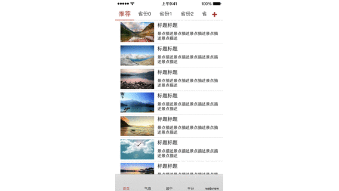

###2.TBActionSheet

简介：类似系统自带的UIActionSheet

Github地址:[Github](https://github.com/yulingtianxia/TBActionSheet)

中文介绍地址:[作者博客地址](http://yulingtianxia.com/blog/2016/07/18/TBActionSheet/)

切图（来自源作者）:
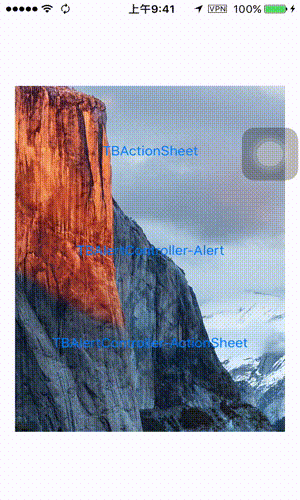

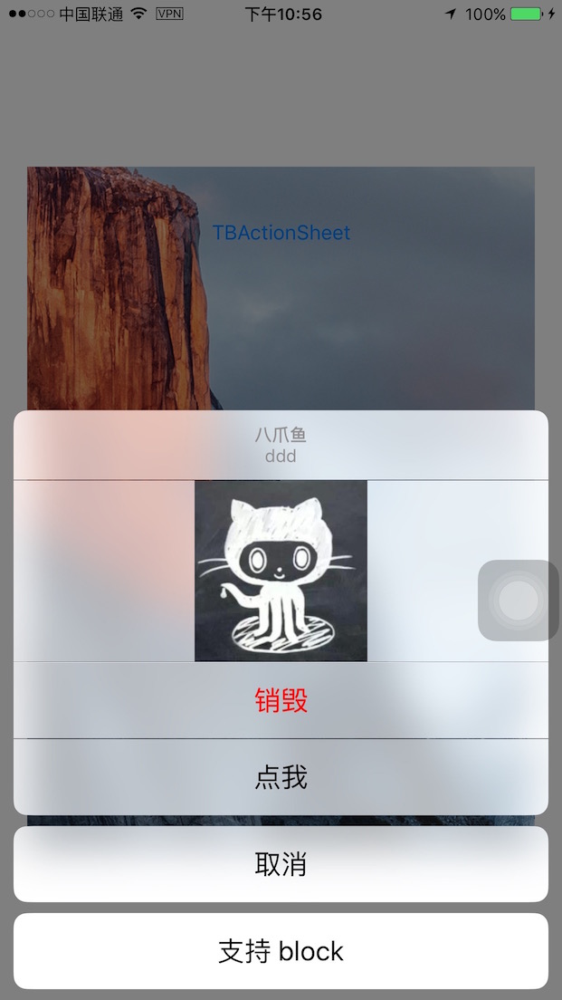

###3.ActionSheetPicker-3.0

介绍：ActionSheetPicker = UIPickerView + UIActionSheet

Github地址:[Github](https://github.com/skywinder/ActionSheetPicker-3.0)

切图（来自源作者）:
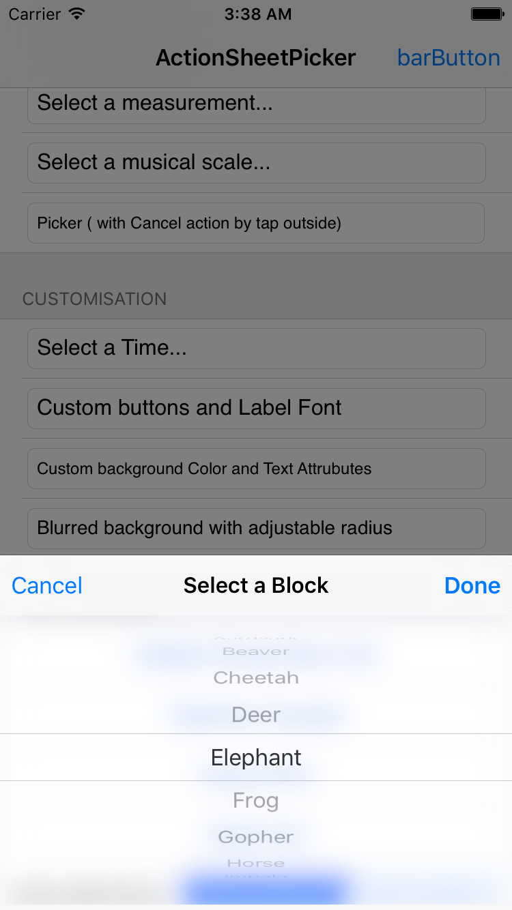
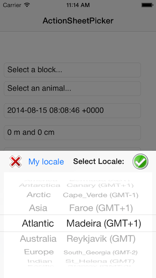
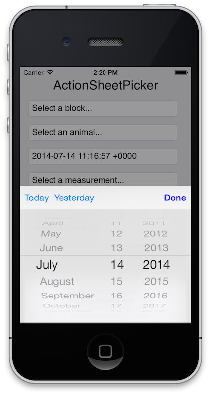

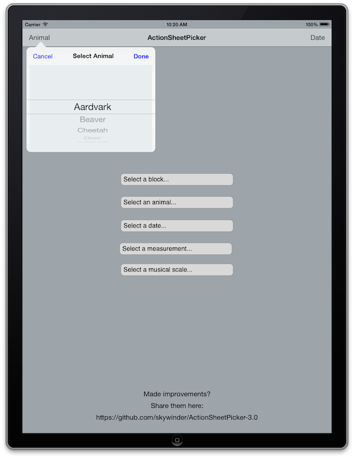
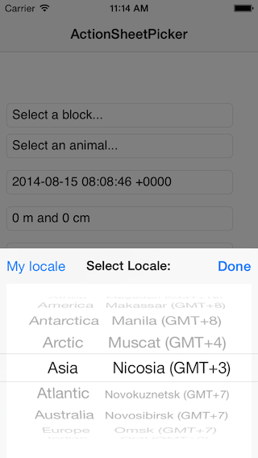
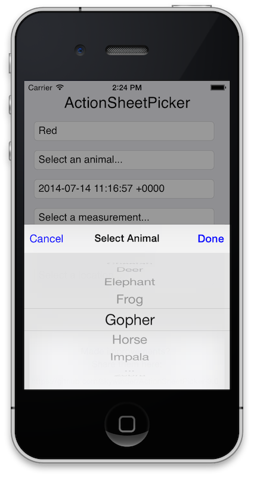
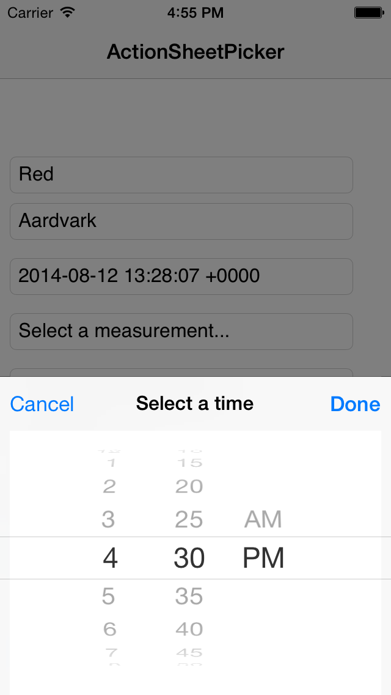

###4.LPActionSheet

简介：仿微信的弹出sheet
Github地址:[Github](https://github.com/wenxiangjiang/LPActionSheet)
中文介绍地址：[简书](http://www.jianshu.com/p/e76e0db0c953)

切图（来自源作者）:
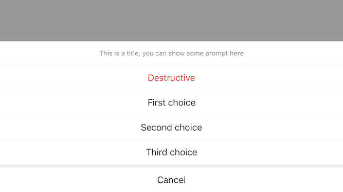
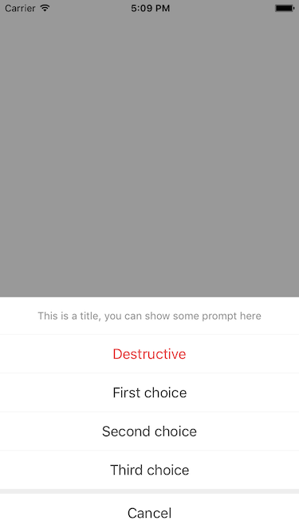