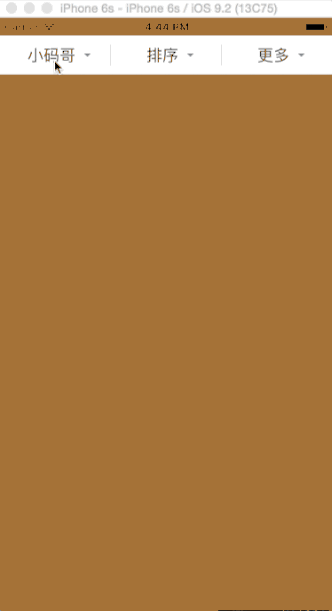
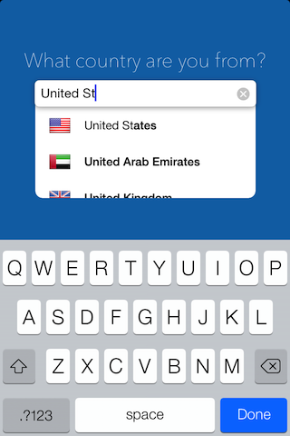
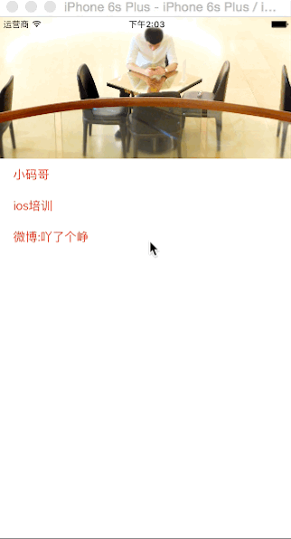

# iOS-Vendor-Collection
iOS第三方轮子收集，做个笔记。

##UI

###1.VTMagic

介绍：似网易、腾讯等应用的菜单分页组件,上有导航切换按钮，下面切换页面，很常见的功能，具体效果见动态图。

Github地址 [Github](https://github.com/tianzhuo112/VTMagic)

中文介绍地址：[简书](http://www.jianshu.com/p/cb2edb21055f)

切图（来自源作者）:

###2.TBActionSheet

简介：类似系统自带的UIActionSheet

Github地址:[Github](https://github.com/yulingtianxia/TBActionSheet)

中文介绍地址:[作者博客地址](http://yulingtianxia.com/blog/2016/07/18/TBActionSheet/)

切图（来自源作者）:

###3.ActionSheetPicker-3.0

介绍：ActionSheetPicker = UIPickerView + UIActionSheet

Github地址:[Github](https://github.com/skywinder/ActionSheetPicker-3.0)

切图（来自源作者）:

###4.LPActionSheet

简介：仿微信的弹出sheet
Github地址:[Github](https://github.com/wenxiangjiang/LPActionSheet)
中文介绍地址：[简书](http://www.jianshu.com/p/e76e0db0c953)

切图（来自源作者）:

###5.搜索界面下拉菜单框架，类似百度外卖，美团外卖

简介：搜索界面下拉菜单框架

Github地址:[Github](https://github.com/iThinkerYZ/YZPullDownMenuDemo)

中文介绍地址:[简书](http://www.jianshu.com/p/0e1bb29be42e)

截图（来自作者简书）

###6.MLPAutoCompleteTextField输入的时候自动提示

简介：输入的时候自动提示
Github地址:[Github](https://github.com/EddyBorja/MLPAutoCompleteTextField)

截图（来自github）

##效果

###1.facebook 出品的Shimmer一个效果图，文字闪光已过的效果

简介：见截图的效果
Github地址:[Github](https://github.com/facebook/Shimmer)

介绍地址:[Github](https://github.com/facebook/Shimmer)

截图：（来自github）

###2.ParallaxTableViewHeader下拉的时候，头部图片变大

简介：下拉的时候，头部图片变大
Github地址:[Github](https://github.com/Vinodh-G/ParallaxTableViewHeader)

截图：（来自github）

###3.YZHeaderScaleImage 集成tableView头部缩放视图

简介:一行代码快速集成tableView头部缩放视图

Github地址:[Github](https://github.com/iThinkerYZ/YZHeaderScaleImage)

中文介绍地址:[简书](http://www.jianshu.com/p/859e3ef76b05)

截图：（来自简书）
